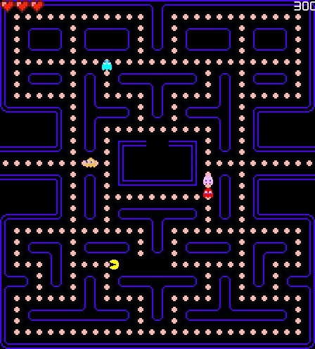

# Pacman

### Current status
* Tilemap
* Pickable food
* moving pacman with collision

## TODO:
* Pacman animation
* Ghosts with random movemenet
* Ghosts animation
* A*
* HUD
* Menu
* Special food

## Download and play
* This game was made with [SFML library](https://www.sfml-dev.org/), in order to play it, install this library
      sudo apt-get install libsfml-dev

* Game:
~~~
git clone https://github.com/prfcto2/PacMan.git
cd PacMan
make
./pacman.out
~~~
