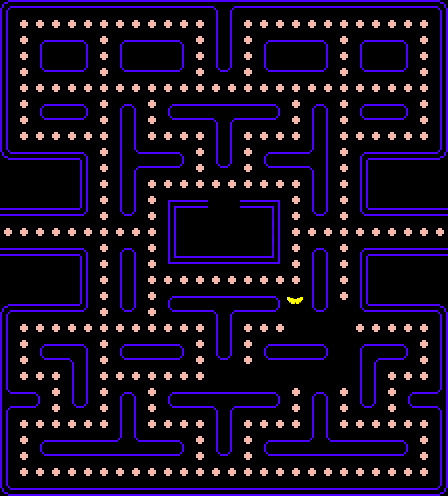

# Pacman

### Current status
* Tilemap
* Pickable food


* Truly moving pacman with collisions, it's also killable pressing space
* Pacman has 3 lives




## TODO:
* ~~Pacman animation~~
* Ghosts with random movemenet
* Ghosts animation
* A* (aksdjaksd this is the pourpuse for all this)
* HUD
* Menu
* Special food (for blue ghosts uuuuuhhh)

## Download and play
* This game was made with [SFML library](https://www.sfml-dev.org/), in order to play it, install this library
```
sudo apt-get install libsfml-dev
```

* Game:
```
git clone https://github.com/prfcto2/PacMan.git
cd PacMan
make
./pacman.out
```
