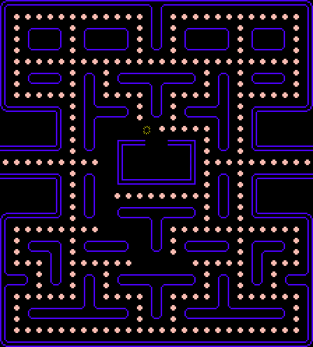
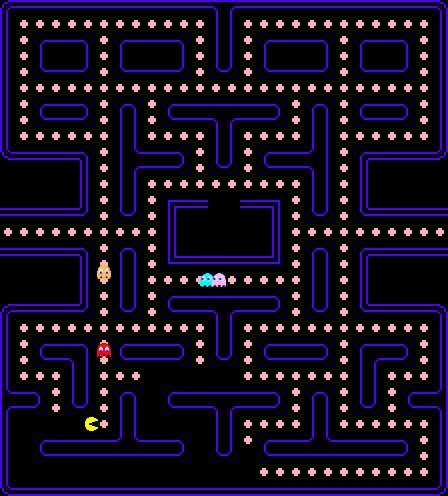
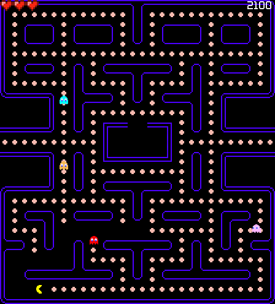
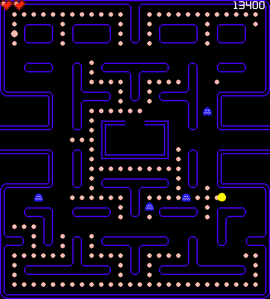

# Pacman


## Download and play
* This game was made with [SFML library](https://www.sfml-dev.org/); in order to play it, install this library
```
sudo apt-get install libsfml-dev
```

* A C++14 compiler is also needed.
* Game:
```
git clone https://github.com/prfcto2/PacMan.git
cd PacMan
make
./pacman.out
```

If you play it I would be glad if you share your experience with me uwu also, I  hope you had found a little joy with it.

## TODO:
* ~~Pacman animation~~
* ~~Ghosts with random movement~~
* ~~Ghosts animation~~
* ~~A* (aksdjaksd this is the purpose for all this)~~
* ~~HUD~~
* ~~Menu~~
* ~~"Game Over" and "You Won!" states~~
* ~~Special food~~
* ~~blue ghosts uuuuuhhh and eye walking ones xDD~~
------------------------

#### Congrats to us all. We have accomplished our first individual project ever. This is a big step for us. It's time to go for another one. Maybe in another language uuuhhhh, that would be a new big step.

## new TODO:
* ~~Music~~
* Colorful GUI uwu
* Try to play it on different machines

## History
* Tilemap
* Pickable food


* Truly moving pacman with collisions, ~~it's also killable pressing space~~
* Pacman has 3 lives




* ghost added, it moves randomly


* lots of ghosts added aksdjaskdas, they have different behaviors which last for a random amount of time, when this time has ended or the target that they had been chasing it's reached, their behavior change.





* Ghosts kill Pacman when they touch him aksdjaskd


* Cute HUD added and now there is a SCORE MARK




* now we have big dots aksdasjkdsa


* eatable blue ghosts when a big dot is eaten asjdkjaskdjask




* Game Over and Game Won states added askdjaskdjks


* Little menu added uwu, it seems baad, but it does what it's meant to.


### MVP achieved

* Music have been added aksjdkas It is a little annoying xD
